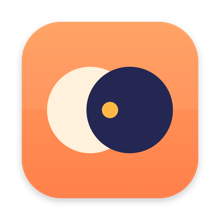
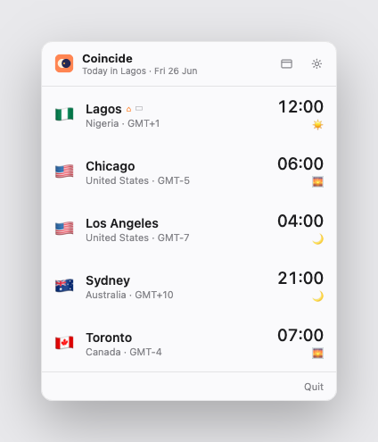
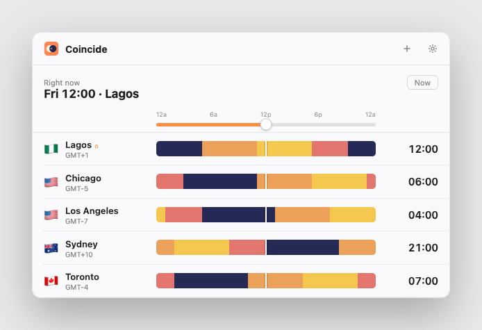

<div align="center">



# Coincide

### See when your hours line up.

A minimalist macOS **menu bar app + widget** that keeps your home time and the
zones you work with side by side — so remote workers never miscount the hours
or miss a meeting again.


</div>

Built for the everyday remote-work question: *"It's 4pm here — what time is it
for my team in PST? Have they already gone home? Is it tomorrow there yet?"*
Coincide answers it at a glance, from the menu bar.

## Screenshots

**Menu bar popover** — every zone with its flag, country, current time, a
day/night indicator, and a `Tomorrow` / `Yesterday` tag when the date differs.

<p align="center"></p>

**Main window** — drag the **time scrubber** to shift time and watch every zone
update together; the 24-hour **day/night bands** (navy night → warm day) line up
on one axis, so you can instantly spot a slot that works for everyone.

<p align="center"></p>

## Features

- 🕒 **Menu bar at a glance** — your chosen reference zone's flag + time, always
  visible and refreshed every minute.
- 📋 **One-click popover** — all your zones with flags, country names, GMT
  offsets, day/night glyphs, and day-difference tags.
- 🌅 **Day/night, everywhere** — a sun/moon indicator per zone, plus full
  24-hour day/night bands in the dashboard, so you can see who's awake.
- 🎚️ **Time scrubber** — shift time across all zones on a shared axis to find
  overlapping working hours and meeting slots.
- 🧩 **Widgets** — small and medium WidgetKit widgets for Notification Center
  and the desktop, sharing the same data as the app.
- 🏠 **Home + unlimited zones** — auto-detects your home zone and lets you add
  as many comparison zones as you like from the full IANA catalog.
- 🪟 **Lives in the menu bar** — with a Dock icon only while a window is open.
- 🌗 **12/24-hour**, drag-to-reorder, launch-at-login.
- 🪶 **Tiny & native** — pure SwiftUI, no dependencies, App Sandbox, no network.

## Architecture

Native SwiftUI. One Xcode project, three targets:

| Target | Type | Purpose |
| --- | --- | --- |
| `Coincide` | macOS app | `MenuBarExtra` popover, dashboard window, onboarding, Preferences |
| `CoincideWidget` | Widget extension | Small/medium WidgetKit widgets |
| `CoincideKit` *(shared sources)* | — | Models, store, time/day-night logic (compiled into the app, widget, and tests) |

App and widget share state through an **App Group**
(`group.dev.bouncei.coincide`) backed by a single JSON blob in `UserDefaults`.
The time, GMT-offset, day-offset, and day/night logic lives in pure,
unit-tested helpers in `CoincideKit` (20 tests).

```
CoincideKit/      SavedZone, ZoneStore, TimeFormatting, DayPhase, TimezoneCatalog, TimezoneCountries
Coincide/         App, MenuBar/, MainWindow/, Onboarding/, Settings/, Resources/
CoincideWidget/   WidgetBundle, TimelineProvider, views
CoincideKitTests/ formatting, store, and flag/country tests
```

> Country flags and names are derived from the system `zone.tab` mapping
> (IANA zone → ISO country code) plus regional-indicator emoji and
> `Locale.localizedString(forRegionCode:)` — no bundled image assets.

## Build & run

This repo uses [XcodeGen](https://github.com/yonsm/XcodeGen) so the Xcode
project is generated from [`project.yml`](project.yml) (and is git-ignored).

```bash
brew install xcodegen     # once
xcodegen generate         # generate Coincide.xcodeproj
open Coincide.xcodeproj
```

In Xcode, select the `Coincide` target → **Signing & Capabilities** → choose
your **Team** (a free personal Apple ID works for local runs), then ⌘R.

### Command line

```bash
# Run the unit tests (no signing required)
xcodebuild test -scheme Coincide -destination 'platform=macOS' \
  -only-testing:CoincideKitTests CODE_SIGNING_ALLOWED=NO

# Compile everything
xcodebuild build -scheme Coincide -destination 'platform=macOS' CODE_SIGNING_ALLOWED=NO
```

## Shipping to the App Store

The project is structured App Store–ready (App Sandbox + App Group + hardened
runtime). To submit you need a **paid Apple Developer Program** membership:

1. Set `DEVELOPMENT_TEAM` in `project.yml` (or pick your team in Xcode) and run
   `xcodegen generate`.
2. Register the App Group `group.dev.bouncei.coincide` and both bundle IDs
   (`dev.bouncei.Coincide`, `dev.bouncei.Coincide.Widget`) on the Developer
   portal — or let Xcode's automatic signing create them.
3. Reserve the **App Store listing name** in App Store Connect. The bare name
   "Coincide" is already taken, so reserve a qualified name such as
   **"Coincide – Time Zones"** — the app, bundle ID, and branding stay "Coincide".
4. **Product → Archive → Validate App**, then distribute.

> Forking? Change the bundle ID prefix and App Group to your own reverse-DNS
> domain in `project.yml` and the two `*.entitlements` files.

## Contributing

Contributions welcome — see [CONTRIBUTING.md](CONTRIBUTING.md). Please run the
test suite before opening a PR.

## License

[MIT](LICENSE) © 2026 Joshua Inyang
